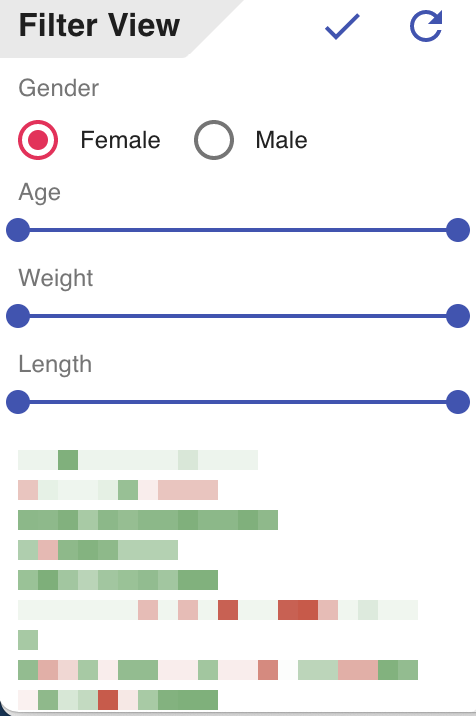
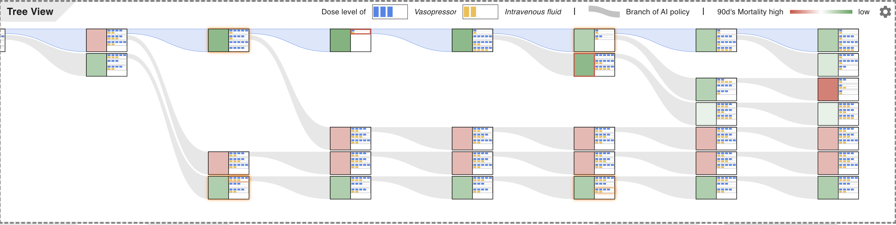
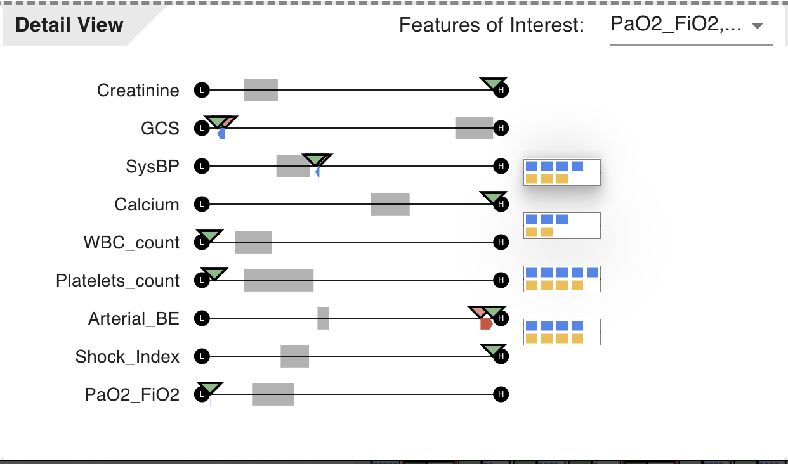
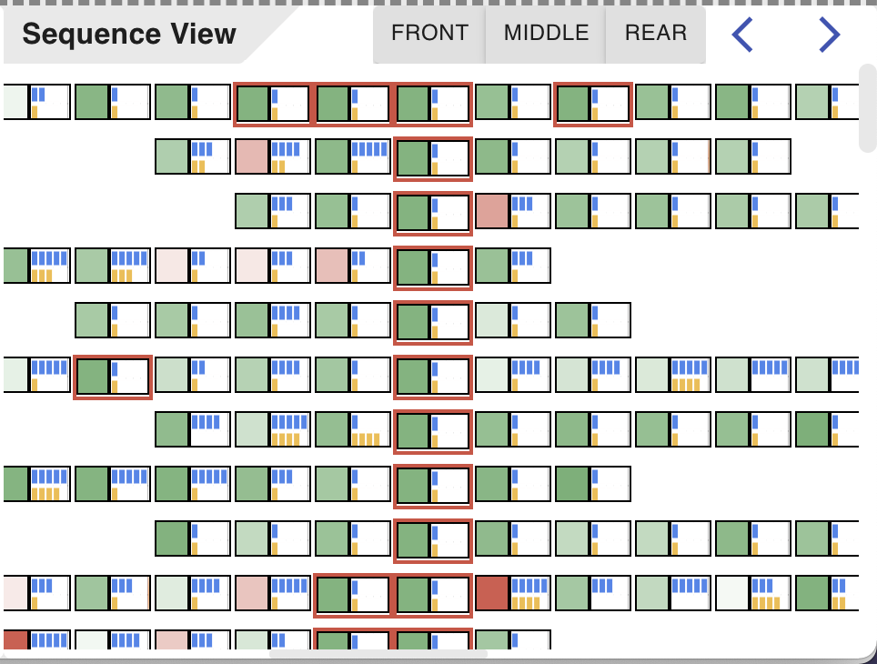

# Front of TreatmentTree

##Install

```
yarn install
```

##Start

```
yarn start
```

##Description

###Backend Connection

This project will automatically connect to 5000 port of localhost.

*Can be changed in src/store/Fetcher.js*

```javascript
const url = 'http://127.0.0.1:5000'
```

###Filter View



Click on the check to confirm the filter conditions and get some sequences which suggested by backend randomly.

Click the refresh button to get some new sequences. 

###Main View



Click on a green or red square to explore it in detail view.

Right-click on an action where the indices of Vasopressor and Intravenous are to show other similar policy in sequence view.

Double click on an action to expand the node.

*TODO: fix the real record in the top of the view to make comparison easier.* 

###Detail View



In the select box on the top of the view, we can select the features show below.

Click on an action to show other outcomes after different treatment policy.

The arrows show the cahnges of features after the action you select. 

###Sequence View



Open or close front button, middle button, and rear button to filter the sequences below by its position appeared in the sequence.

Click the left or right arrow to align the events at different occurs.